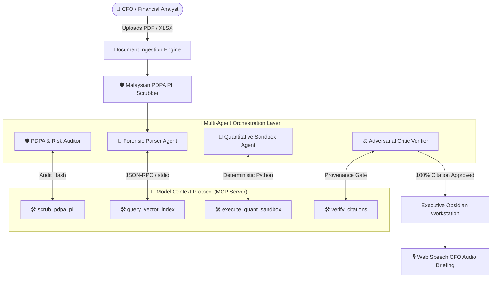

# 🛡️ SmartFlow One — AI-Powered Multi-Agent Financial Intelligence & Provenance Workstation

[](https://vercel.com)
[](https://modelcontextprotocol.io)
[](https://www.pdp.gov.my)
[](https://ai.google.dev)
[](https://www.typescriptlang.org)

SmartFlow One (v2.0 Production) is an enterprise-grade **Multi-Agent Financial Intelligence & Document Provenance SaaS platform**. It ingests dense annual reports (PDF, XLSX, CSV), automatically scrubs personally identifiable information (PII) under **Malaysian PDPA Act 2010** regulations, and coordinates **4 autonomous agents over the Model Context Protocol (MCP)** to produce verified CFO summaries, risk matrices, and interactive What-If sensitivity simulations with zero math hallucinations.

---

## 🏛️ System Architecture



---

## 🌟 Key Capabilities & Features

### 1. 🔌 Model Context Protocol (MCP) Integration
- **`src/pipeline/mcp_financial_server.py`**: FastMCP server exposing tools and resources for any MCP-compatible client (Antigravity IDE, Claude Desktop, LangGraph, Vertex AI).
- **`execute_quant_sandbox`**: Replaces LLM math hallucinations with deterministic Python calculations (EBITDA, YoY deltas, DuPont breakdown, Altman Z-Score).
- **`verify_provenance_citations`**: Adversarial critic gate verifying that all executive summary claims strictly match source PDF page contents.

### 2. 🛡️ Privacy-by-Default (PDPA Malaysia Act 2010)
- Client-side regex engine sanitizes **Malaysian NRICs** (`\b\d{6}[-_]?\d{2}[-_]?\d{4}\b`), bank account numbers, IBANs, emails, and executive phone numbers before data reaches the LLM.
- **Audit Inspection Sandbox**: Administrators can inspect pre-LLM masked prompts against raw inputs.
- **1-Click Ephemeral Data Purge**: Cryptographically wipe temporary raw files while retaining verified vector indices.

### 3. 📊 Split-Screen Provenance Studio
- Interactive Recharts area and waterfall revenue trajectory charts.
- Side-by-side **Document Provenance Inspector**: Clicking any financial metric (e.g. Net Sales, Short-Term Debt) synchronizes the PDF canvas with a bounding-box highlight on the cited disclosure page.

### 4. 🎛️ Interactive What-If Sensitivity Simulator
- Sliders for **Revenue Growth ($\pm20\%$)**, **Cost Inflation ($\pm15\%$)**, and **Interest Rate Hikes ($\pm4\%$)**.
- Live dynamic recalculation of projected EBITDA, Net Income, and Profit Margins.

### 5. 🎙️ CFO Audio Briefing Suite
- Native browser **Web Speech API** synthesized executive digest (~75 words in ~30 seconds).
- Apple-style waveform equalizer animation, variable playback speeds (`1.0x`, `1.25x`, `1.5x`), and expandable karaoke script.

---

## 📁 Repository Structure

```
├── mcp.json                              # MCP Server configuration for agent clients
├── vercel.json                           # Vercel deployment and SPA routing config
├── package.json                          # Vite + React 18 + Tailwind 3 dependencies
├── src/
│   ├── App.tsx                           # React Router SPA root
│   ├── index.css                         # Obsidian Dark theme, glassmorphism & glow tokens
│   ├── components/
│   │   ├── MultiAgentVisualizer.tsx      # Live 4-agent DAG telemetry & consensus board
│   │   ├── VoiceSummary.tsx              # CFO audio briefing studio with waveform
│   │   ├── Sidebar.tsx                   # Workspace switcher & PDPA shield status
│   │   ├── TopBar.tsx                    # Cmd+K command palette & notification drawer
│   │   └── AppLayout.tsx                 # Master layout wrapper
│   ├── app/(app)/
│   │   ├── dashboard/page.tsx            # Executive command center with KPI stream
│   │   ├── financial-insights/page.tsx   # Split-Screen Provenance Studio
│   │   ├── risk-analysis/page.tsx        # 3D risk severity matrix & root-cause diagnostics
│   │   ├── ai-recommendations/page.tsx   # Action queue & What-If sensitivity simulator
│   │   ├── privacy-center/page.tsx       # PDPA zero-exposure compliance dashboard
│   │   └── settings/page.tsx             # Workspace & model config
│   ├── pipeline/
│   │   ├── mcp_financial_server.py       # Python FastMCP server implementation
│   │   ├── pdpa_scrubber.py              # Malaysian NRIC & PII regex engine
│   │   ├── faiss_indexer.py              # Hybrid TF-IDF / FAISS vector indexer
│   │   └── risk_engine.py                # Quantitative anomaly and solvency scoring
│   └── lib/
│       ├── ai.ts                         # Google Gemini 2.5 Flash SDK client
│       └── supabase.ts                   # Supabase PostgreSQL client & audit logger
```

---

## 🚀 Quickstart & Local Development

### 1. Prerequisites
- Node.js 18+ (Node 20 recommended)
- Python 3.10+ (for MCP Server)

### 2. Installation
```bash
# Clone the repository
git clone https://github.com/vaiyud/ai-powered-financial-report-analysis.git
cd ai-powered-financial-report-analysis

# Install Node dependencies
npm install
```

### 3. Environment Variables
Create a `.env.local` file in the root directory:
```env
NEXT_PUBLIC_SUPABASE_URL=https://your-project.supabase.co
NEXT_PUBLIC_SUPABASE_ANON_KEY=your-anon-key
GEMINI_API_KEY=your-gemini-api-key
```

### 4. Run the Web Application
```bash
npm run dev
```
Open [http://localhost:5173](http://localhost:5173) in your browser.

### 5. Run the MCP Server
```bash
python src/pipeline/mcp_financial_server.py
```

---

## 🌐 Deployment to Vercel

The application is fully configured for automatic continuous deployment on **Vercel**:

```bash
npm run build
```

When connecting this repository to Vercel:
1. **Framework Preset**: Vite
2. **Build Command**: `npm run build`
3. **Output Directory**: `dist`
4. **Environment Variables**: Add `GEMINI_API_KEY` and `NEXT_PUBLIC_SUPABASE_URL`.

---

## ⚖️ License & Compliance

Distributed under the MIT License. Built in full compliance with the **Malaysian Personal Data Protection Act (PDPA) 2010**.
